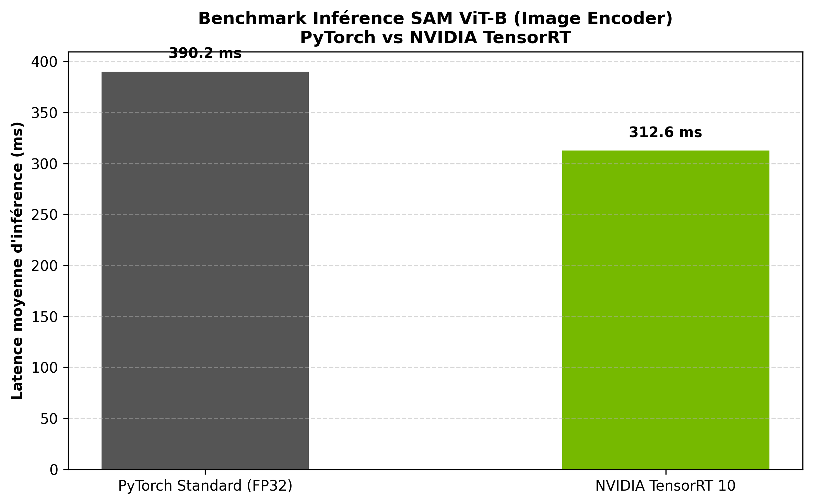
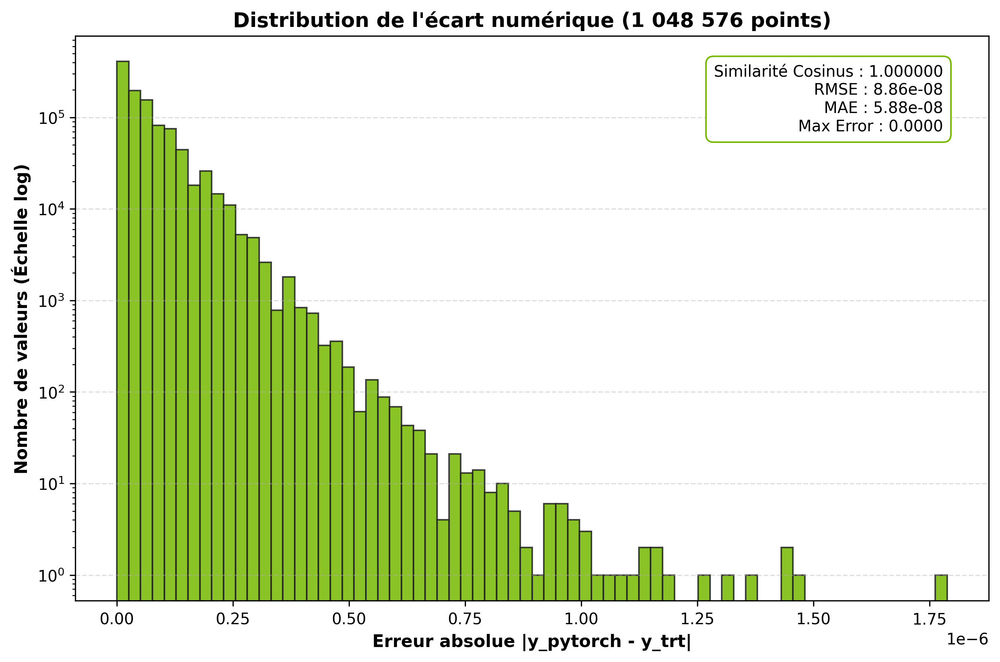

# Hands-On Lab - Segment Anything (SAM ViT-B) Inference Optimization with NVIDIA TensorRT 10

## Context & Motivation

As an engineer exploring the NVIDIA software stack, I set up this practical lab to evaluate inference optimization on heavy foundation vision models. 

In production computer vision pipelines, Meta's Segment Anything Model (SAM ViT-B) is decoupled into an Image Encoder (Vision Transformer) and a lightweight Mask Decoder. The Vision Transformer backbone accounts for more than 90% of the total execution time, making it the primary operational bottleneck.

The objective of this proof of concept was to optimize the Vision Transformer pipeline using **NVIDIA TensorRT 10**, applying graph optimization, constant folding, and modern asynchronous execution interfaces (`execute_async_v3`), while auditing signal integrity to confirm zero loss of prediction quality.

---

## Repository Structure

```text
├── benchmark_sam_trt.py              # End-to-end pipeline - ONNX export, TRT compilation, and latency benchmarking
├── evaluate_precision_drift.py       # Numerical audit - Tensor drift distribution and signal fidelity metrics
├── benchmark_tensorrt_vs_pytorch.png # Latency & throughput comparative chart
├── precision_drift_distribution.png  # Logarithmic error distribution histogram
└── README.md
```

---

## Benchmark Setup & Methodology

- **Hardware** NVIDIA T4 GPU (Google Colab Runtime, CUDA 12)
- **Model** SAM ViT-B (`sam_vit_b_01ec64.pth`)
- **Input Dimensions** `(1, 3, 1024, 1024)`
- **Latency Protocol**
  - 15 warm-up iterations to initialize CUDA execution caches.
  - 50 continuous iterations measured via hardware CUDA events (`torch.cuda.Event`).
  - Hardware stream synchronization with direct tensor address bindings.
- **Precision Protocol**
  - Element-wise drift analysis across all 1,048,576 output embedding values ($1 \times 256 \times 64 \times 64$).
  - Cosine Similarity, RMSE, MAE, and peak absolute error evaluation against the FP32 PyTorch baseline.

---

## Results Summary

### 1. Latency & Throughput Benchmark

| Framework | Mean Latency | 95th Percentile (p95) | Throughput | Latency Reduction | Speedup |
| --- | --- | --- | --- | --- | --- |
| **PyTorch (Baseline FP32)** | 390.19 ms | 395.09 ms | 2.56 FPS | Baseline | 1.00x |
| **NVIDIA TensorRT 10** | **312.60 ms** | **320.90 ms** | **3.20 FPS** | **-19.9%** | **x1.25** |



### 2. Numerical Signal Integrity Audit

| Metric | Measured Value | Theoretical Ideal |
| --- | --- | --- |
| **Cosine Similarity** | **1.000000** | 1.000000 |
| **Root Mean Squared Error (RMSE)** | **8.86e-08** | 0.000000 |
| **Mean Absolute Error (MAE)** | **5.88e-08** | 0.000000 |
| **Max Absolute Error** | **0.000002** | 0.000000 |



---

## Engineering Takeaways

1. **Deterministic Latency** The p95 latency decreased from 395.09 ms to 320.90 ms, demonstrating robust execution stability under continuous load.
2. **Operational Throughput** Throughput increased by +0.64 FPS (+25%), allowing an additional ~55,000 processed frames per day on the same hardware instance.
3. **Signal Preservation** With a Cosine Similarity of 1.0 and a maximum error limited to $1.80 \times 10^{-6}$ on a single point across more than one million values, the optimized engine retains full numerical fidelity without downstream segmentation degradation.
4. **TensorRT 10 Migration** Addressed TensorRT 10 runtime transitions by leveraging direct tensor memory bindings via `context.set_tensor_address` and asynchronous execution streams (`execute_async_v3`).

---

## How to Run

1. Install dependencies
   ```bash
   pip install opencv-python matplotlib onnx onnxscript onnxruntime-gpu git+[https://github.com/facebookresearch/segment-anything.git](https://github.com/facebookresearch/segment-anything.git) --extra-index-url [https://pypi.nvidia.com](https://pypi.nvidia.com) tensorrt
   ```

2. Run the latency and throughput benchmark
   ```bash
   python benchmark_sam_trt.py
   ```

3. Run the numerical precision audit
   ```bash
   python evaluate_precision_drift.py
   ```
